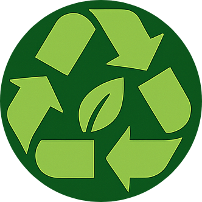
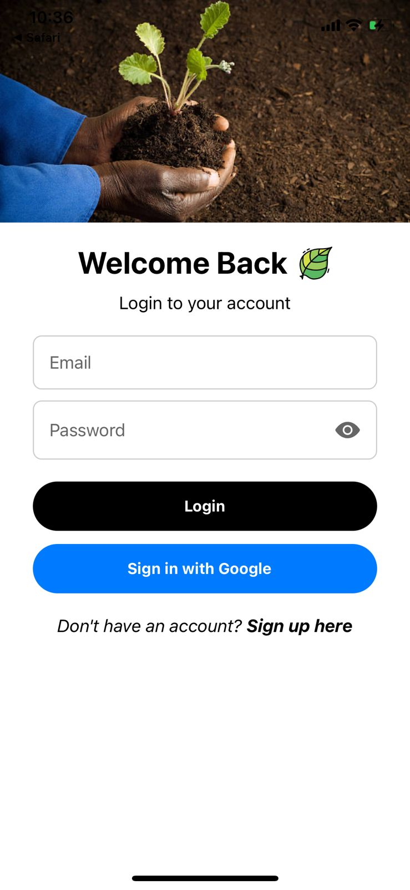
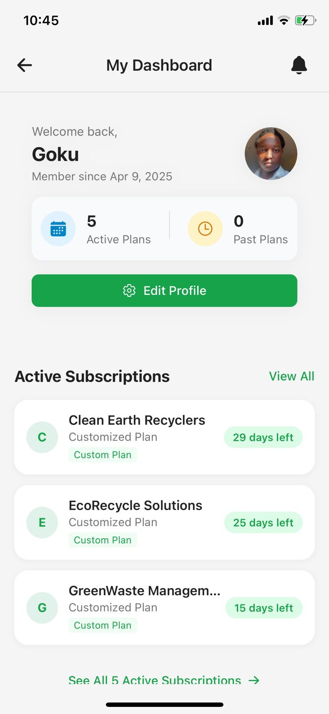
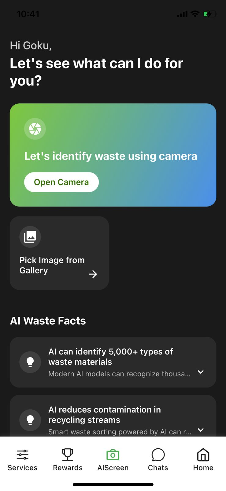
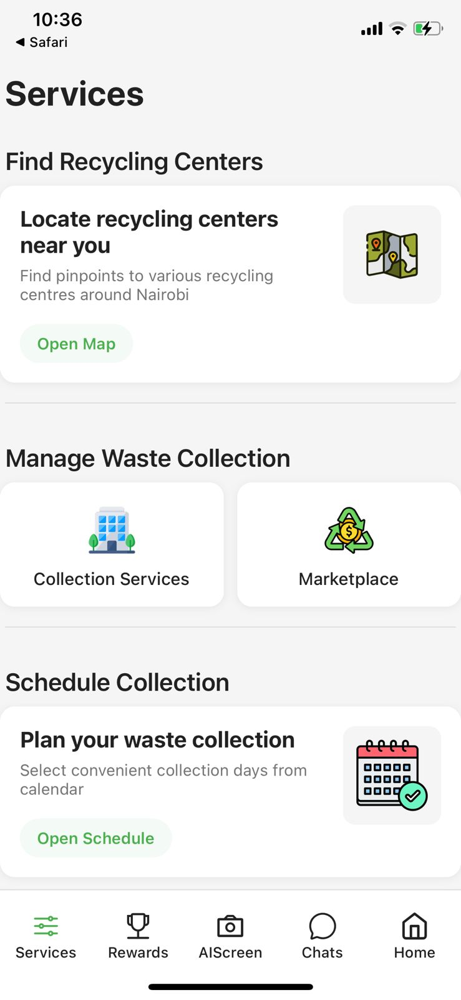
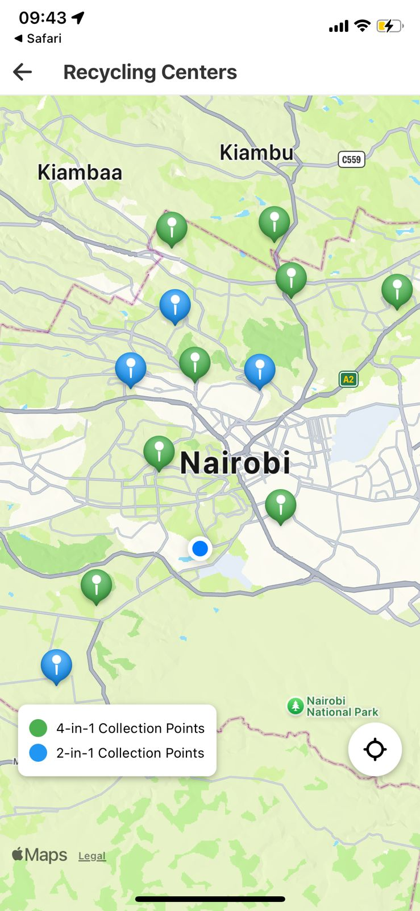
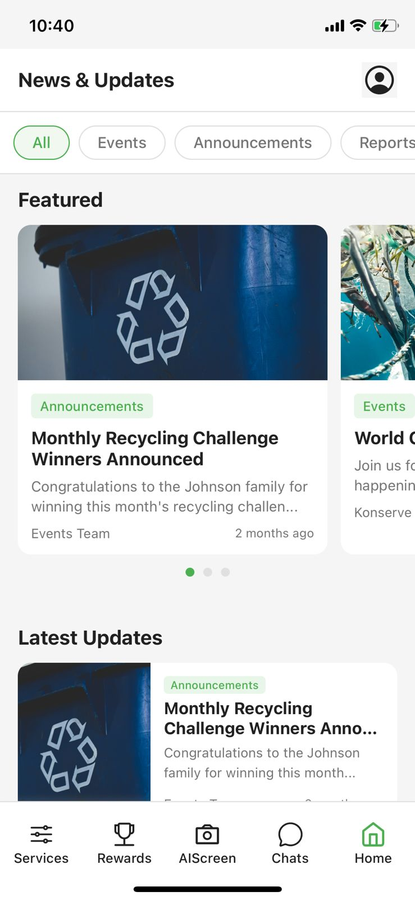
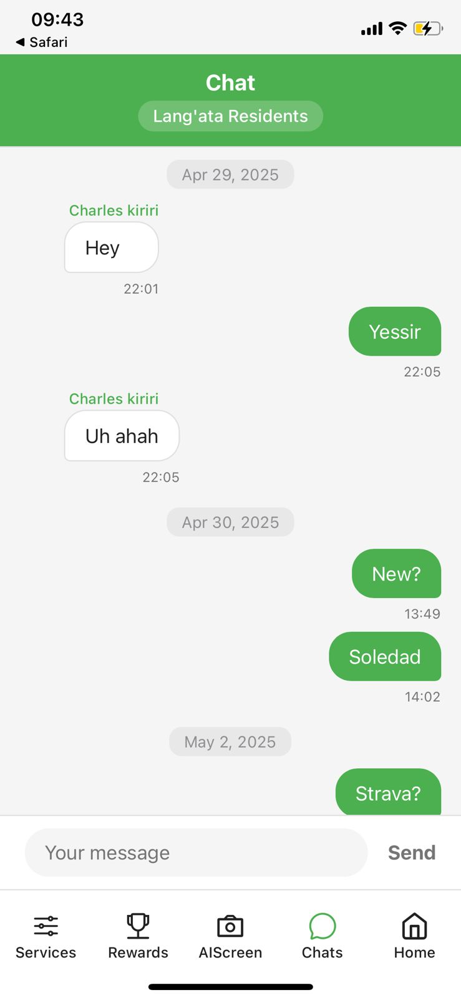
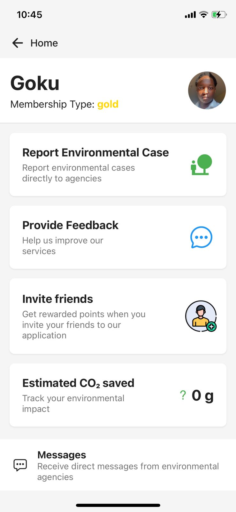

# Konserve - Smart Waste Management Platform

<div align="center">
  
  
  [](https://reactnative.dev/)
  [](https://expo.dev/)
  [](https://supabase.com/)
  [](https://www.typescriptlang.org/)
  
  *Empowering communities, Digitizing Waste. Building a Greener Nairobi.*
</div>

## 📱 Screenshots

<table>
  <tr>
    <td align="center">
      
      <br><em>Login Screen</em>
    </td>
    <td align="center">
      
      <br><em>User Dashboard</em>
    </td>
    <td align="center">
      
      <br><em>AI Waste Scanner</em>
    </td>
    <td align="center">
      
      <br><em>Services Menu</em>
    </td>
  </tr>
  <tr>
    <td align="center">
      
      <br><em>Recycling Centers Map</em>
    </td>
    <td align="center">
      
      <br><em>News & Updates</em>
    </td>
    <td align="center">
      
      <br><em>Community Chat</em>
    </td>
    <td align="center">
      
      <br><em>Option Services Menu</em>
    </td>
  </tr>
</table>

## 🌍 Overview

Konserve is a comprehensive mobile application that connects waste management stakeholders across Nairobi into a unified digital ecosystem. By combining AI-powered waste identification, real-time community engagement, and convenient recycling solutions, Konserve is building a cleaner, greener future for Kenya's capital city.

### 🎯 Mission
To reduce landfill waste, increase recycling rates, and create sustainable waste management practices through technology-driven community engagement.

## ✨ Key Features

### 🔐 **Authentication & User Management**
- **Secure Registration/Login**: Email-based authentication with Supabase
- **Constituency-based Organization**: Users grouped by Nairobi constituencies
- **Profile Management**: Complete user profiles with waste activity tracking
- **Password Security**: Secure password handling with validation

### 🤖 **AI-Powered Waste Identification**
- **Smart Waste Scanner**: Advanced image recognition using Google Cloud Vision API
- **Waste Category Detection**: Identifies plastic, paper, metal, electronic, organic, and hazardous waste
- **Recyclability Assessment**: Instant feedback on whether items are recyclable
- **Disposal Guidance**: Detailed recycling tips and proper disposal methods
- **Environmental Impact**: Information on biodegradability and environmental effects

### 📰 **News & Information Hub**
- **Waste Management News**: Latest updates on recycling, environmental policies
- **Event Announcements**: Community waste collection events and initiatives
- **Educational Content**: Tips and guides for sustainable waste practices
- **Category Filtering**: Filter news by events, announcements, and reports

### 💬 **Community Chat System**
- **Constituency-based Chat**: Connect with neighbors in your specific area
- **Real-time Messaging**: Live chat powered by Supabase real-time subscriptions
- **Environmental Discussions**: Share waste reduction tips and local initiatives
- **Community Building**: Foster environmental awareness at the grassroots level

### 🎯 **Gamification & Rewards**
- **Points System**: Earn points for waste-related activities
- **Leaderboards**: Compete with community members for environmental impact
- **Reward Codes**: Redeem special codes for bonus points
- **Activity Tracking**: Monitor your environmental contributions over time

### 🗺️ **Interactive Services**

#### **Recycling Centers Map**
- **Google Maps Integration**: Find nearby recycling facilities across Nairobi
- **Location Services**: GPS-enabled discovery of the closest centers
- **Facility Information**: Contact details, operating hours, and accepted materials
- **Turn-by-turn Directions**: Integrated navigation to recycling centers

#### **Waste Collection Services**
- **Agency Discovery**: Browse waste collection companies by constituency
- **Service Comparison**: Compare prices, services, and customer ratings
- **Subscription Management**: Subscribe to regular waste collection services
- **Payment Integration**: Secure payments through M-Pesa and other methods
- **Schedule Customization**: Choose collection days and frequency

#### **Waste Marketplace**
- **Buy/Sell Platform**: Connect with waste buyers and sellers
- **Material Categories**: Trade recyclable materials like plastic, metal, paper
- **Price Transparency**: Market rates for different waste materials
- **Direct Messaging**: Chat with potential buyers/sellers
- **Location-based Trading**: Find opportunities in your area

### 📅 **Smart Calendar & Reminders**
- **Collection Schedules**: Track waste collection dates
- **Event Calendar**: Community clean-up events and recycling drives
- **Custom Reminders**: Set personal waste management goals
- **Integration**: Sync with device calendar for better planning

### 📊 **User Dashboard**
- **Activity Overview**: Personal waste management statistics
- **Subscription Management**: Track active waste collection services
- **Payment History**: View transaction records and receipts
- **Environmental Impact**: Measure your contribution to waste reduction

### 🔔 **Smart Notifications**
- **Push Notifications**: Reminders for collection days and events
- **Message Alerts**: New chat messages and marketplace inquiries
- **Service Updates**: Changes to collection schedules or new services
- **News Alerts**: Important environmental announcements

### 📝 **Feedback & Support**
- **Service Reviews**: Rate and review waste collection agencies
- **App Feedback**: Help improve the platform with your suggestions
- **Issue Reporting**: Report environmental concerns in your area
- **Customer Support**: Direct communication with service providers

### 🏢 **Business Solutions**
- **Business Profiles**: Specialized features for commercial waste management
- **Bulk Services**: Large-scale waste collection for businesses
- **Custom Contracts**: Negotiate terms with waste management companies
- **Environmental Reporting**: Track corporate sustainability metrics

## 🛠️ Technology Stack

### **Frontend**
- **React Native 0.79.1**: Cross-platform mobile development
- **Expo 53.0.0**: Development platform and deployment
- **TypeScript 5.8.3**: Type-safe JavaScript development
- **React Navigation 7.x**: Navigation and routing
- **React Native Maps**: Interactive mapping functionality

### **Backend & Database**
- **Supabase**: Backend-as-a-Service with PostgreSQL
- **Supabase Auth**: User authentication and session management
- **Supabase Realtime**: Live data synchronization for chat
- **Edge Functions**: Serverless functions for business logic

### **AI & External Services**
- **Google Cloud Vision API**: Image recognition for waste identification
- **Google Maps API**: Location services and mapping
- **Paystack/M-Pesa**: Payment processing integration
- **Expo Notifications**: Push notification system

### **Development Tools**
- **ESLint**: Code linting and formatting
- **Metro**: JavaScript bundler for React Native
- **EAS Build**: Cloud-based app building
- **Git**: Version control

## 🚀 Getting Started

### Prerequisites
- Node.js 18+ 
- npm or yarn
- Expo CLI (`npm install -g @expo/cli`)
- Android Studio (for Android development)
- Xcode (for iOS development, macOS only)

### Installation

1. **Clone the repository**
   ```bash
   git clone https://github.com/yourusername/konserve.git
   cd konserve
   ```

2. **Install dependencies**
   ```bash
   npm install
   ```

3. **Environment Setup**
   Create a `.env` file in the root directory:
   ```env
   SUPABASE_URL=your_supabase_url
   SUPABASE_ANON_KEY=your_supabase_anon_key
   GOOGLE_CLOUD_VISION_API_KEY=your_google_vision_api_key
   GOOGLE_MAPS_API_KEY=your_google_maps_api_key
   PAYSTACK_PUBLIC_KEY=your_paystack_public_key
   ```

4. **Configure app.config.js**
   Update the configuration with your environment variables:
   ```javascript
   export default {
     expo: {
       extra: {
         SUPABASE_URL: process.env.SUPABASE_URL,
         SUPABASE_KEY: process.env.SUPABASE_ANON_KEY,
         GOOGLE_CLOUD_VISION_API_KEY: process.env.GOOGLE_CLOUD_VISION_API_KEY,
         // ... other config
       }
     }
   }
   ```

### Development

1. **Start the development server**
   ```bash
   npm start
   ```

2. **Run on specific platforms**
   ```bash
   # Android
   npm run android
   
   # iOS
   npm run ios
   
   # Web
   npm run web
   ```

3. **Database Setup**
   - Set up your Supabase project
   - Run the SQL migrations in `/database/` directory
   - Configure Row Level Security (RLS) policies
   - Set up authentication providers

4. **Configure External Services**
   - Enable Google Cloud Vision API
   - Set up Google Maps API with required permissions
   - Configure payment providers (Paystack/M-Pesa)
   - Set up push notification certificates

## 🏗️ Project Structure

```
konserve/
├── app/                    # Expo Router app directory
├── assets/                 # Images, fonts, and static assets
├── components/             # React Native components
│   ├── screens/           # Main app screens
│   ├── navigation/        # Navigation components
│   └── ui/               # Reusable UI components
├── constants/             # App constants and configuration
├── contexts/              # React contexts for state management
├── database/              # Database schemas and migrations
├── hooks/                 # Custom React hooks
├── services/              # API services and external integrations
├── supabase/              # Supabase configuration and managers
│   ├── config/           # Supabase client configuration
│   ├── functions/        # Edge functions
│   ├── manager/          # Data access layer
│   └── migrations/       # Database migrations
├── utils/                 # Utility functions
└── scripts/              # Build and deployment scripts
```

## 🗄️ Database Schema

The application uses a comprehensive PostgreSQL schema with the following main tables:

### **Core Tables**
- `users` - User profiles and authentication data
- `agencies` - Waste collection companies
- `agencies_business` - Business-focused waste agencies
- `subscription_plans` - Service plans and pricing
- `user_subscriptions` - Active user subscriptions

### **Messaging & Communication**
- `messages` - Community chat messages
- `agency_messages` - Agency announcements
- `user_message_status` - Read/unread message tracking

### **Marketplace & Trading**
- `waste_buyers` - Marketplace participants
- `waste_listings` - Available materials for trade
- `marketplace_messages` - Buyer-seller communications

### **Payments & Transactions**
- `payment_transactions` - Payment records
- `subscription_history` - Subscription lifecycle tracking

### **Location & Services**
- `operational_areas` - Service coverage areas
- `collection_routes` - Waste collection routes
- `recycling_centers` - Facility locations and details

## 📡 API Integration

### **Supabase Edge Functions**
- `register-user` - User registration with profile creation
- `agency-pushnotifications` - Notification delivery
- `check-expired-subscriptions` - Subscription management

### **External APIs**
- **Google Cloud Vision**: Waste image analysis
- **Google Maps**: Location services and mapping
- **Paystack**: Payment processing
- **M-Pesa**: Mobile money integration

## 🔒 Security Features

- **Authentication**: Secure email/password authentication with Supabase Auth
- **Row Level Security**: Database-level access control
- **API Security**: Authenticated API calls with JWT tokens
- **Data Validation**: Input sanitization and validation
- **Payment Security**: PCI-compliant payment processing
- **Privacy Protection**: User data encryption and secure storage

## 📱 Supported Platforms

- **Android**: Android 6.0+ (API level 23+)
- **iOS**: iOS 13.0+
- **Web**: Modern browsers (development/admin access)

## 🧪 Testing

```bash
# Run tests
npm test

# Run linting
npm run lint

# Type checking
npm run type-check
```

## 📦 Building for Production

### **EAS Build (Recommended)**
```bash
# Install EAS CLI
npm install -g eas-cli

# Configure builds
eas build:configure

# Build for Android
eas build --platform android

# Build for iOS
eas build --platform ios
```

### **Local Builds**
```bash
# Android APK
npm run build:android

# iOS Archive
npm run build:ios
```

## 🚀 Deployment

### **App Distribution**
- **Google Play Store**: Android app distribution
- **Apple App Store**: iOS app distribution
- **Expo Application Services**: Internal testing and distribution

### **Backend Deployment**
- **Supabase**: Managed backend infrastructure
- **Edge Functions**: Serverless function deployment
- **Database**: Automated backups and scaling

## 🤝 Contributing

We welcome contributions to improve Konserve! Please read our [Contributing Guidelines](CONTRIBUTING.md) before submitting pull requests.

### **Development Process**
1. Fork the repository
2. Create a feature branch (`git checkout -b feature/amazing-feature`)
3. Commit your changes (`git commit -m 'Add amazing feature'`)
4. Push to the branch (`git push origin feature/amazing-feature`)
5. Open a Pull Request

### **Code Style**
- Follow the existing code style
- Use TypeScript for type safety
- Write descriptive commit messages
- Add tests for new features

## 📄 License

This project is licensed under the MIT License - see the [LICENSE](LICENSE) file for details.

## 👥 Team

- **Developer**: Prince Hope WK
- **Backend Architecture**: Supabase Integration
- **AI Integration**: Google Cloud Vision
- **UI/UX Design**: React Native & Expo

## 📞 Support

For support and inquiries:
- **Email**: wkurts247@gmail.com
- **GitHub Issues**: [Report bugs or request features](https://github.com/yourusername/konserve/issues)

## 🌟 Acknowledgments

- **Supabase**: For providing an excellent backend-as-a-service platform
- **Expo**: For simplifying React Native development and deployment
- **Google Cloud**: For powerful AI and mapping services
- **Open Source Community**: For the amazing libraries and tools

## 🔮 Roadmap

### **Upcoming Features**
- [ ] Carbon footprint tracking
- [ ] Advanced AI waste sorting recommendations
- [ ] Expanded coverage beyond Nairobi
- [ ] Corporate sustainability dashboard
- [ ] Waste-to-energy tracking
- [ ] Social sharing features
- [ ] Environmental impact visualization

### **Long-term Vision**
- Multi-city expansion across Kenya
- Integration with government waste management systems
- AI-powered waste collection optimization
- Blockchain-based waste tracking
- IoT sensor integration for smart bins

---

<div align="center">
  <p><strong>Building a sustainable future, one app at a time 🌱</strong></p>
</div>
